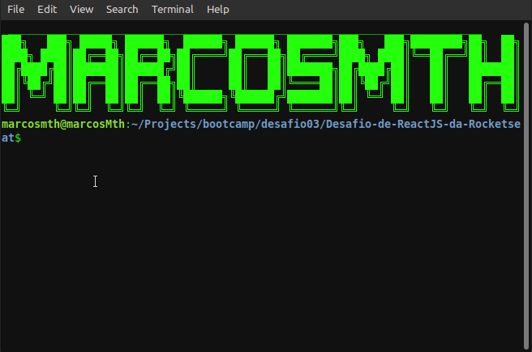

# Desafio 03: Conceitos do ReactJS
Esse é o desafio 03 do Bootcamp da Rocketseat (turma goStack11) das aulas de ReactJS.
<h2>Objetivo</h2>

Fazer um front-end que se comunique com o back-end criado no desafio de <a href="https://github.com/MarcosMthJr/Desafio-02-Conceitos-do-Node.js">NodeJS</a> com as opções de listar, adicionar e deletar um repositório.

<h3>Saída do teste automatizado</h3>
